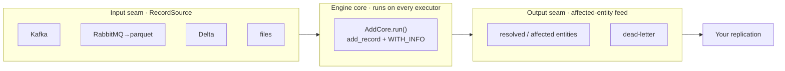

# 01 · Architecture

The whole mental model in one page: **one engine, on Spark, between two seams.**



Everything sz_spark does is one of three things: **get records in** (input seam), **resolve them**
(engine core), **get results out** (output seam). Pick adapters for the seams; the core stays the same.

## The engine core

Senzing is a native library (`libSz`) invoked over JNI. Two rules shape everything:

- **One engine per JVM, not per task.** Each Spark executor builds exactly one `SzEnvironment`
  (`SzEngineProvider`, a create-once/destroy-at-shutdown singleton). All of that executor's task
  threads drive it concurrently under a shared read lock. Building one per task would blow up memory
  and violate the SDK's one-environment-per-process contract.
- **The jar is self-contained.** `sbt stageNatives assembly` bakes the native libs, models, and
  schema DDL into the FAT jar; each executor self-extracts them at startup
  ([`NativeBootstrap`](../../src/main/scala/com/senzing/spark/nativelib/NativeBootstrap.scala)). No
  `/opt/senzing` install on the cluster.

Records are resolved by [`AddCore.run`](../../src/main/scala/com/senzing/spark/core/AddCore.scala):
`add_record` with the `WITH_INFO` flag, which returns the **affected entities** for each record — the
raw material for the output seam.

Config changes (new data sources, resolution rules) are picked up live by
[`ConfigDrift`](../../src/main/scala/com/senzing/spark/engine/ConfigDrift.scala) — no restart.

## The input seam — `RecordSource`

One small interface decides where records come from
([`RecordSource.scala`](../../src/main/scala/com/senzing/spark/glue/RecordSource.scala)):

```scala
trait RecordSource {
  def initialCursor: String                 // where to resume
  def nextChunk(cursor: String): Option[Chunk]   // claim the next batch (lazy DataFrame)
  def commit(bounds: String): Unit          // mark a batch done
  def reclaim(): Unit                        // recover in-flight work after a restart
}
```

It has **two commit flavors**, and that choice is the whole on-prem-vs-lakehouse split:

| Flavor | `commit` means | `reclaim` | Where it works |
|---|---|---|---|
| **Dispose** | delete/archive the claimed files (atomic rename) | move in-flight files back | POSIX / on-prem only |
| **Watermark** | advance a monotonic cursor (offset / version) | no-op (re-read from cursor) | Object-store safe |

Shipped adapters: `InboxSource` (dispose, RabbitMQ path), `KafkaSource` and `DeltaSource`
(watermark). Writing your own is Guide 05.

## The feeder — why batches don't stall

The engine is driven by the
[`OverlappingBatchEngine`](../../src/main/scala/com/senzing/spark/glue/OverlappingBatchEngine.scala),
which exists to solve one problem: **the straggler tail.** Some records take orders of magnitude
longer than others (a huge, dense entity), and you can't predict which.

The operating point: **one partition per ~1,000-record batch, and many batches in flight** (K ≈ the
cluster's slot count). Each batch is a single independent task that commits on its own, so a slow
record holds exactly **one** slot while the rest keep flowing. No cluster-wide barrier — the only idle
time is genuine end-of-input.

> The knob is records, not partitions: set `recordsPerBatch` (default 1000) and
> `maxUnprocessedBatches` (≥ `spark.cores.max`). Full rationale in
> [`PARALLEL_BATCH_FEEDER.md`](../PARALLEL_BATCH_FEEDER.md).

## The output seam — the affected-entity feed

Because every `add_record` runs `WITH_INFO`, the feeder emits a **change feed of affected entities**
(plus a dead-letter feed for failures). That feed is your integration point: replicate the resolved
entity graph anywhere — a Delta table, an online store, a warehouse. Guide 06 builds one; dead-letter
mechanics are in [`DEAD_LETTER.md`](../DEAD_LETTER.md).

## Guarantees

- **At-least-once, never-drop.** A batch that fails is never committed, so it's re-read on restart.
  Re-adding an already-resolved record is a fast, optimized no-op — so replay is cheap and safe.
- **Idempotent downstream.** Dedup on `(dataSource, recordId)` / `(…, entityId)`; the feed carries
  the keys you need.

## Engine-build parity (non-negotiable)

`sbt stageNatives` bakes **whatever engine is in `SENZING_DIR`** into the jar — silently. If two nodes
(or two runs you're comparing) carry different engine builds, they resolve differently and perform
differently, with no error to warn you. **Every node must run the same engine build.** Verify the
runtime `apiVersion` (from `get_stats`) matches across the fleet before trusting any result or
comparison. Procedure: [`BUILD_AGAINST_FLEET_ENGINE.md`](../BUILD_AGAINST_FLEET_ENGINE.md).

---

Next: **[02 · Getting started](02-getting-started.md)** — build the jar and run your first load.
