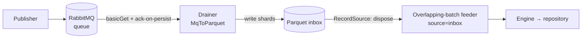

# 03 · RabbitMQ setup

The on-prem path: a message queue feeds the engine through a durable **parquet inbox** on shared disk.
Use this when you're on a POSIX filesystem (not object storage).



Two independent processes, decoupled by the inbox:

- **Drainer** (`glue.MqToParquet`) — a plain competing consumer. Pulls the queue, writes
  ~`shardRecords`-record parquet shards, then acks. It's **persist-then-ack**: a record is acked only
  after it's durably on disk, so a crash never drops it (it's redelivered).
- **Feeder** (`glue.ParquetParallelFeeder source=inbox`) — claims shards, runs them through the engine,
  disposes them on commit.

## Run it

```bash
# 1. Drainer — queue → parquet inbox (see "Backpressure" before running under load)
spark-submit --master 'local[*]' --class com.senzing.spark.glue.MqToParquet \
  sz-spark-assembly.jar amqpUrl="$AMQP" queue="$QUEUE" inbox="$INBOX" shardRecords=1000

# 2. Feeder — parquet inbox → engine
spark-submit --master "$SPARK_MASTER" --class com.senzing.spark.glue.ParquetParallelFeeder \
  sz-spark-assembly.jar source=inbox inbox="$INBOX" processing="$PROC" \
  recordsPerBatch=1000 maxUnprocessedBatches=200 output="$AFFECTED" deadLetter="$DLQ"
```

## The three things that will bite you

**1. The drainer must be gated.** Ack-on-persist means the drainer pulls the queue at its *parquet-write*
speed — far faster than the engine resolves — so left unbounded it drains the whole queue to disk and
the inbox grows without limit. Gate it with an **inbox-depth supervisor** that pauses the drainer when
the inbox is deep and resumes it when it drains. On the reference fleet this is `run-drainer.sh`
(gated by default) + `backpressure.sh`; the pattern is: `inbox > HIGH → pause`, `inbox < LOW → resume`.

**2. `shardRecords` must equal the feeder's batch size.** The drainer's shard size *is* the feeder's
batch size (one shard = one 1-partition batch). Set `shardRecords` = `recordsPerBatch` (e.g. both
`1000`). A mismatch (say 5000 vs 1000) makes every batch 5× too big — one slow record then stalls a
5,000-record task instead of a 1,000-record one.

**3. Ack rate ≠ throughput on this path.** Because the drainer acks on *persist*, the queue's ack rate
measures how fast records land in parquet, **not** how fast they're entity-resolved. Measure real
throughput at the repository (e.g. row-insert rate), not the queue.

## When to use it

POSIX / on-prem, where the atomic-rename dispose flavor works. On object storage (S3/ADLS/GCS) rename
isn't atomic — use the **[Kafka path](04-kafka-setup.md)** instead, which needs no shared filesystem.

---

Next: **[04 · Kafka setup](04-kafka-setup.md)** — the streaming / lakehouse path.
