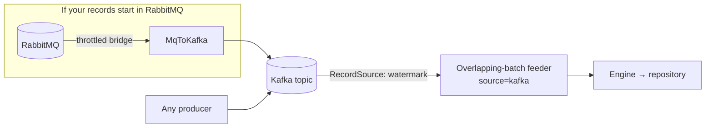

# 04 · Kafka setup

The streaming / lakehouse path: records flow through a **Kafka topic** and the engine tracks its
position with a durable **watermark**. No shared filesystem — this is the object-store-safe,
Databricks-native path.



Two ways in:

- **Records already in Kafka** — point the feeder at the topic. Done.
- **Records in RabbitMQ** — run the `glue.MqToKafka` bridge to move them onto a topic first (below).

## Run it

```bash
# Feeder — Kafka topic → engine. The connector is 'provided', so add it at submit:
spark-submit --master "$SPARK_MASTER" \
  --packages org.apache.spark:spark-sql-kafka-0-10_2.13:4.0.1 \
  --class com.senzing.spark.glue.ParquetParallelFeeder sz-spark-assembly.jar \
  source=kafka bootstrapServers="$BROKERS" topic=sz-records checkpoint="$CKPT" \
  startingOffset=earliest recordsPerBatch=1000 maxUnprocessedBatches=200 \
  output="$AFFECTED" deadLetter="$DLQ"

# Optional bridge — RabbitMQ → Kafka, self-throttling
spark-submit --master 'local[*]' --class com.senzing.spark.glue.MqToKafka \
  sz-spark-assembly.jar amqpUrl="$AMQP" queue="$QUEUE" \
  bootstrapServers="$BROKERS" topic=sz-records checkpoint="$CKPT" maxLag=5000000
```

## Design, in four points

**One unpartitioned topic.** Read parallelism comes from `minPartitions` fanning the single partition
into N Spark tasks — *not* from Kafka partitions. Partitioning by anything correlated with a resolution
key would scatter related records across tasks and create lock contention. Keep the topic
single-partition.

**Count-bounded batches.** Each batch claims `[cursor, cursor + recordsPerBatch)`. A large backlog
becomes many small batches, never one giant straggler-prone one — this is what keeps the feeder
tail-free.

**A contiguous-completed-prefix watermark.** The feeder's workers commit *out of order*, but a
monotonic offset can only advance over the contiguous prefix. `glue.OffsetWatermark` holds a
completed-but-behind-a-gap batch until the gap fills, then advances and persists a durable checkpoint.
A restart re-reads from the committed offset; replaying an already-resolved record is a cheap no-op.

**Backpressure is in-band.** The bridge self-limits to `maxLag`: it reads the feeder's committed offset
and pauses producing when the topic gets more than `maxLag` records ahead. Unlike the RabbitMQ
drainer's external supervisor, this can't be bypassed — the throttle *is* the code.

## Delta instead of Kafka

The same watermark seam works over a Delta table's change feed (`source=delta`, cursor = table
version) — see [`glue.DeltaSource`](../../src/main/scala/com/senzing/spark/glue/DeltaSource.scala). It's
version-granular rather than record-granular, so prefer Kafka when you want the tightest batch sizing.

## When to use it

Object storage, Databricks, or any streaming source. On Databricks the connector and low-latency
serving are already present; see [`DATABRICKS.md`](../DATABRICKS.md).

---

Next: **[05 · Adopt your own source](05-adopt-your-own-source.md)** — neither queue fits? Bring your own.
