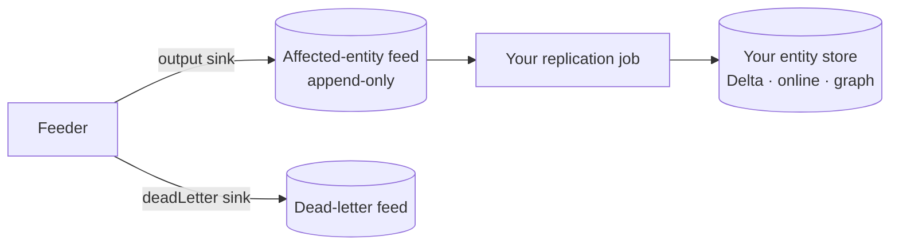

# 06 · Adapt your own replication

Resolving records is only half the job — you usually need the **resolved entities** somewhere else: a
serving store, a warehouse, a graph. sz_spark gives you a change feed to build that on.

## The affected-entity feed

Every record is added with the `WITH_INFO` flag, so the engine returns, per record, the **entities it
affected**. The feeder writes that as an append-only feed (the `output` sink) alongside a `deadLetter`
feed for failures:



Each affected-entity row carries the `entityId` and the `(dataSource, recordId)` that touched it. When
records merge or split, you get a row for every entity whose membership changed — so re-materializing
those entities keeps your store consistent.

## The pattern

A replication job is a second, independent consumer of the feed:

1. **Read** new rows from the affected-entity feed (watermark on the feed itself — it's just another
   monotonic source, so the [Guide 05](05-adopt-your-own-source.md) rules apply).
2. **Fetch** the current state of each affected `entityId` from the engine (`get_entity`) — the feed
   tells you *which* entities changed; the engine gives you their *current* content.
3. **Upsert** into your store, keyed by `entityId`. A `MERGE` (Delta) or upsert (online store) makes it
   idempotent, so replay is safe.

```scala
affectedEntities                       // read new rows from the feed
  .select("entityId").distinct         // one refresh per changed entity
  .as[Long].collect                    // (or join, at scale)
  .map(id => engine.getEntity(id))     // current resolved entity as JSON
  // → MERGE INTO entity_store AS t USING updates AS u ON t.entity_id = u.entity_id ...
```

## Three shapes people replicate

| Target | Keyed by | Use for |
|---|---|---|
| **`entity_id → entity JSON`** | entityId | serving the resolved entity (APIs, apps) |
| **Entity map** (`record → entity`) | (dataSource, recordId) | "which entity is my record in?" lookups |
| **Relationships** | (entityId, relatedEntityId) | the resolved graph — networks, disambiguation |

All three are the same pattern (read feed → refresh changed entities → upsert), just a different
projection and key.

## Make it idempotent and safe

- **Key every upsert by `entityId`** (or the entity/relationship key). Then re-processing a feed row —
  which *will* happen, the feed is at-least-once — is a harmless overwrite.
- **Refresh, don't accumulate.** The feed says an entity *changed*; always re-read its current state
  and overwrite. Don't try to apply deltas — entities merge and split.
- **On Databricks**, the read (Auto Loader / Delta CDF) and low-latency serving (DLT / online tables)
  are native; the replication logic above stays the same.

## Reference implementation — it's built in

You don't have to build this from scratch: **[Guide 07 · The entity-mart](07-entity-mart-replication.md)**
implements all three shapes to Delta (local *or* Databricks Unity Catalog) with skip-if-unchanged,
tombstones, both relationship directions, and orphan handling — the same jar, one class. Point it at your
feed to use it, or read its `mart/` package as the worked example for your own store.

---

Back to the **[series index](README.md)**.
