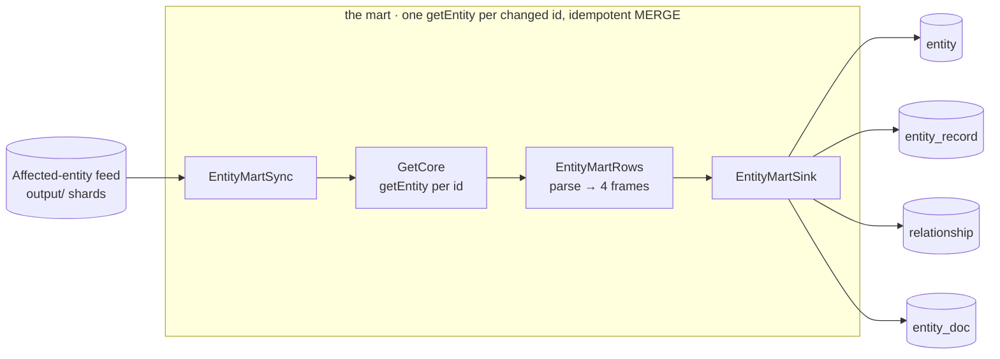

# 07 · The entity-mart (built-in replication)

[Guide 06](06-adapt-your-own-replication.md) taught the replication *pattern*. This guide is the
**batteries-included implementation** of it: point it at the affected-entity feed and it keeps a set of
read-optimized **Delta** tables in sync with your resolved entities — the same on a laptop and on
Databricks.



It replicates **all three shapes** Guide 06 listed, at once — as four Delta tables:

| Table | Grain | Answers |
|---|---|---|
| `entity` | one row / resolved entity (name, counts, representative features, hash) | "what is entity 42?" |
| `entity_record` | the **entity map** — one row / source record | "which entity is my record in?" |
| `relationship` | entity↔entity, normalized `lo < hi` | the resolved graph — networks, disambiguation |
| `entity_doc` | `entity_id → full entity JSON` | point-lookup serving (APIs, apps) |

Plus two bookkeeping tables: `_sync_state` (the refresh watermark) and `_quarantine` (fetch failures).

## The one rule: refresh, don't apply deltas

The engine resolves **in parallel**, so you can't know the order two `add_record`s happened in — trying
to apply the `WITH_INFO` delta would desync you the moment two records touch the same entity. So the mart
does what the Senzing data-mart-replicator prescribes (the **Entity Refresh Pattern**): the feed tells you
*which* entities changed; you re-`getEntity` their **current** state and idempotently overwrite. Order
stops mattering. Everything below falls out of that one choice:

- **Skip-if-unchanged.** Each entity carries a content `entity_hash`; if it's unchanged since last
  refresh, the batch writes nothing (most affected entities are unchanged after re-resolution).
- **Tombstones.** An entity that `getEntity` reports GONE (absorbed/deleted) is cascaded out of all four
  tables.
- **Both relationship directions.** A pair `(lo, hi)` is refreshed from *either* endpoint; a column-wise
  `coalesce` MERGE lets `match_key` and `rev_match_key` accumulate instead of clobbering each other.
- **Orphan records.** A record deleted from a surviving entity has its stale `entity_record` row removed
  (a *move* is re-keyed by the gaining entity's own refresh).
- **Replay-safe.** Every MERGE is keyed and guarded by a monotonic `refresh_seq`, so a re-run after a
  crash is a no-op.

## Run it — local proxy

Any laptop with Spark 4.0 + `delta-spark` (no Databricks account):

```bash
spark-submit \
  --packages io.delta:delta-spark_2.13:4.0.0 \
  --class com.senzing.spark.mart.EntityMartSync sz-spark-assembly.jar \
  feed=/data/sz_io/output \          # the feeders' output= affected-entity dir
  mart=/data/entity_mart \           # a Delta base path (tables created under it)
  trigger=availableNow               # one pass; or trigger=loop cadenceMs=60000
```

Then query it as plain Delta — the [reporting reference](../DESIGN.md) has the analytics SQL (data-source
summary, cross-source overlap, entity-size, match-key frequency) that runs directly on these tables:

```sql
SELECT data_source, COUNT(*) records, COUNT(DISTINCT entity_id) entities
FROM delta.`/data/entity_mart/entity_record` GROUP BY data_source;
```

## Run it — Databricks (Unity Catalog)

The **same jar**. Only the sink target changes — a UC `catalog.schema` instead of a path — and Databricks
already has the Delta SQL extensions, so nothing else differs:

```bash
spark-submit --class com.senzing.spark.mart.EntityMartSync sz-spark-assembly.jar \
  sink=uc \
  mart=main.entity_mart \            # a Unity Catalog catalog.schema (tables created under it)
  feed=/Volumes/main/sz/io/output \
  staging=/Volumes/main/sz/mart_staging   # required for uc: a cluster-writable Volume/DBFS dir
```

`DatabricksUcSink` reuses **every** line of the MERGE/DELETE logic — it only names tables
`catalog.schema.table` instead of `` delta.`/path/table` ``. See [DATABRICKS.md](../DATABRICKS.md) for the
cluster conf.

| | **`sink=local`** | **`sink=uc`** |
|---|---|---|
| Target | Delta base **path** (`mart=/data/entity_mart`) | UC **catalog.schema** (`mart=main.entity_mart`) |
| Delta extensions | job sets them (`--packages delta-spark`) | preset on the cluster |
| Staging | defaults to `<mart>/_staging` | **required** (a Volume/DBFS dir) |
| Best for | on-prem, POSIX, CI | Databricks-native serving |

## Arguments

| Arg | Required | Meaning |
|---|---|---|
| `feed` | ✓ | the feeders' `output=` affected-entity dir |
| `mart` | ✓ | Delta base **path** (`sink=local`) or UC **`catalog.schema`** (`sink=uc`) |
| `sink` | | `local` (default) or `uc`/`databricks` |
| `staging` | uc only | GetCore's scratch dir; defaults to `<mart>/_staging` for local |
| `trigger` | | `availableNow` (one pass, default) or `loop` |
| `cadenceMs` | | `loop` sleep between passes (default 60000) |

## Scope & what's next

- The mart is the **entity/relationship serving-map** archetype. The Senzing reference *also* defines an
  **analytics-reporting** archetype (`sz_dm_report` DSS/CSS/ESB/ERB aggregates) — deliberately not built
  here; a lakehouse consumer aggregates over this map with the reference's own SQL.
- Coverage: `EntityMartRowsSpec` (the pure transform, golden-file) + `EntityMartSinkIT` (real Delta
  MERGE/DELETE — relationship coalesce, monotonic guard, tombstone cascade, change-gate, orphan
  reconcile). `DatabricksUcSinkSpec` covers the UC naming; a live-UC smoke is the remaining Databricks
  validation.
- Phase-2 hardening (tracked in `NEXT_STEPS.md`): a `getRecord`-verify before an orphan delete (avoids a
  brief cross-batch move transient), and reconcile-read pruning.

---

Back to the **[series index](README.md)**.
