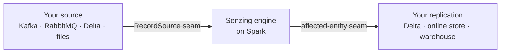

# sz_spark — Guides

Run the [Senzing](https://senzing.com) entity-resolution engine at scale on Apache Spark, from any
record source, into any datastore — and replicate the resolved entities anywhere.

sz_spark is a **reference implementation**: a small, composable core (the engine on Spark) plus two
seams you adapt to your world — where records come **in**, and where resolved entities go **out**.

## The guides

Read in order the first time; jump back as reference later.

| # | Guide | You'll learn |
|---|---|---|
| 01 | [Architecture](01-architecture.md) | The engine-on-Spark model and the two seams — the whole mental model in one page |
| 02 | [Getting started](02-getting-started.md) | Build the jar, run your first load, verify it resolved |
| 03 | [RabbitMQ setup](03-rabbitmq-setup.md) | The on-prem path: queue → parquet → engine, with backpressure |
| 04 | [Kafka setup](04-kafka-setup.md) | The streaming / lakehouse path: topic → engine, with a durable watermark |
| 05 | [Adopt your own source](05-adopt-your-own-source.md) | Implement the `RecordSource` seam for any input |
| 06 | [Adapt your own replication](06-adapt-your-own-replication.md) | Turn the affected-entity feed into your own entity store |

## Which path do I want?

| | **RabbitMQ path** (Guide 03) | **Kafka path** (Guide 04) |
|---|---|---|
| Best for | On-prem, POSIX filesystem | Lakehouse / Databricks, object storage |
| Durable buffer | Parquet inbox on shared disk | Kafka topic (or a Delta table) |
| Commit model | Dispose (atomic rename) | Monotonic watermark (offset / version) |
| Object-store safe | No (rename isn't atomic on S3/ADLS/GCS) | Yes |
| Backpressure | Inbox-depth supervisor | In-band lag throttle |

Not on either? Guide 05 shows how to point the engine at **your** source — the core doesn't care.

## Prerequisites

- A Spark 4.0.x cluster (or `local[*]` to start), Java 21.
- A licensed Senzing SDK to build the self-contained jar (Guide 02). No install needed on executors.
- A supported datastore for the engine's repository (PostgreSQL, etc.).

> **One rule that will save you a day:** every node must run the **same engine build**. See
> [Architecture → Engine-build parity](01-architecture.md#engine-build-parity-non-negotiable).

## Deeper reference

These guides teach the concepts; the reference docs go deep on specifics —
[`DESIGN.md`](../DESIGN.md), [`PERFORMANCE.md`](../PERFORMANCE.md),
[`PARALLEL_BATCH_FEEDER.md`](../PARALLEL_BATCH_FEEDER.md), [`DEAD_LETTER.md`](../DEAD_LETTER.md),
[`DATABRICKS.md`](../DATABRICKS.md), [`BUILD_AGAINST_FLEET_ENGINE.md`](../BUILD_AGAINST_FLEET_ENGINE.md).
